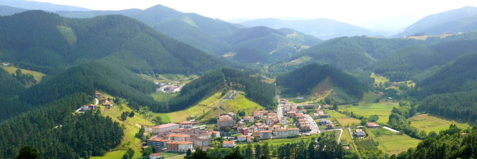

<!DOCTYPE html>
<html lang="eu">
<head>
    <meta charset="UTF-8">
    <title>Sarrera</title>
    
    <body bgcolor= "yellow"> 
</head>
<body>
    <h1>Sarrera Orrialdea</h1>
    <nav>
        <a href="lehena.html">Lehena</a>
        <a href="bigarrena.html">Bigarrena</a>
        <a href="hirugarrena.html">Hirugarrena</a>
    </nav>
    
Hau da Berritxu, bizkaiko herririk ederrena

    
</body>
</html>
